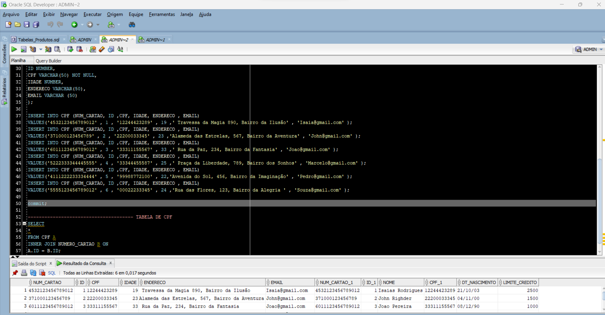

Etapa1: Criação da Tabela Cartão de Creditos, com seus respectivos Dados (CREATE E A INSERÇÃO DOS VALORES)

Etapa 2: Criação da Tabela CPF, com seus respectivos Dados (CREATE E A INSERÇÃO DOS VALORES)

Etapa3: INNER JOIN entre as duas tabelas de Cartao de Credito e CPF

